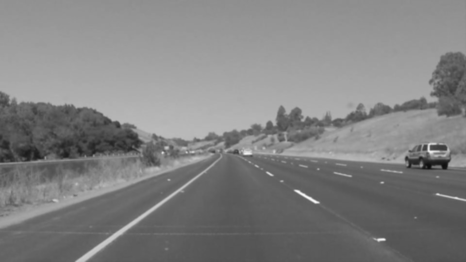
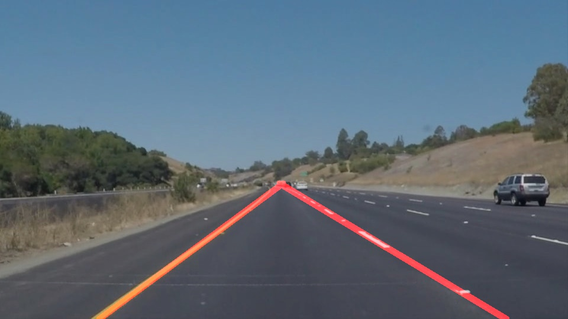

# **Finding Lane Lines on the Road** 

---

**Finding Lane Lines on the Road**

The goals / steps of this project are the following:
* Make a pipeline that finds lane lines on the road
* Reflect on your work in a written report

[//]: # (Image References)

[image1]: ./examples/grayscale.jpg "Grayscale"

---

### Reflection

### 1. Describe your pipeline. As part of the description, explain how you modified the draw_lines() function.

The pipeline consisted of 5 steps. 

1. Converted the images from rgb to grayscale to make it easier to find the edges in the image

2. On the grayscaled image, we run the Gaussian blur to reduce image noise and reduce detail.

3. The resulting image is run through canny edge detection to find all the edges in the image

4. Since our interest is finding the lane lines, we find the regions of interest where our lane line falls in the image. The resulting image only contains the part of the image we are interested

5. With interested region identified in the image, we run Hough transform on this to identify the lane lines

Additionally, In order to draw a single line on the left and right lanes, draw_lines() was modified to combine the disjoint lines. We got a set of lines that Hough trasform identified. We separate the left and right lanes using the slope of the lines, right being negative slope and left being positive slope. We aggragate the slope and center of left and right lane separately. We average both the slope and center for the left and right lanes. We use the line equation to find the x intercepts since we know the slopes/center of left and right lanes and y-intercepts which is roughly in the middle of the screen. This lets us plot a single lane that represents the set of disjoint lines.

The following images shows how the image goes through the various pipeline before detecting the lane lines after joining the disjoint lines.

### 2. Identify potential shortcomings with your current pipeline

The current pipeline is not accounted for identifying various light conditions including cloudy days or night time driving. The pipeline also does not account for curves well in the road. If there are other objects or disturbnaces inside our lanes, we have not eliminated them to identify the lane lines with accuracy.

### 3. Suggest possible improvements to your pipeline

A possible improvement could be to adjust the slope thresholds to make sure it works on various curvy roads.

Another potential improvement could be to mask out unnecessary distraction in the region of interests like the dashboard. We could also try to do color thresholding to remove some more noise. Though i have tried to make some threshold adjustement to take care of the curvy road, more adjustmenet is required to handle complex scenerios.
